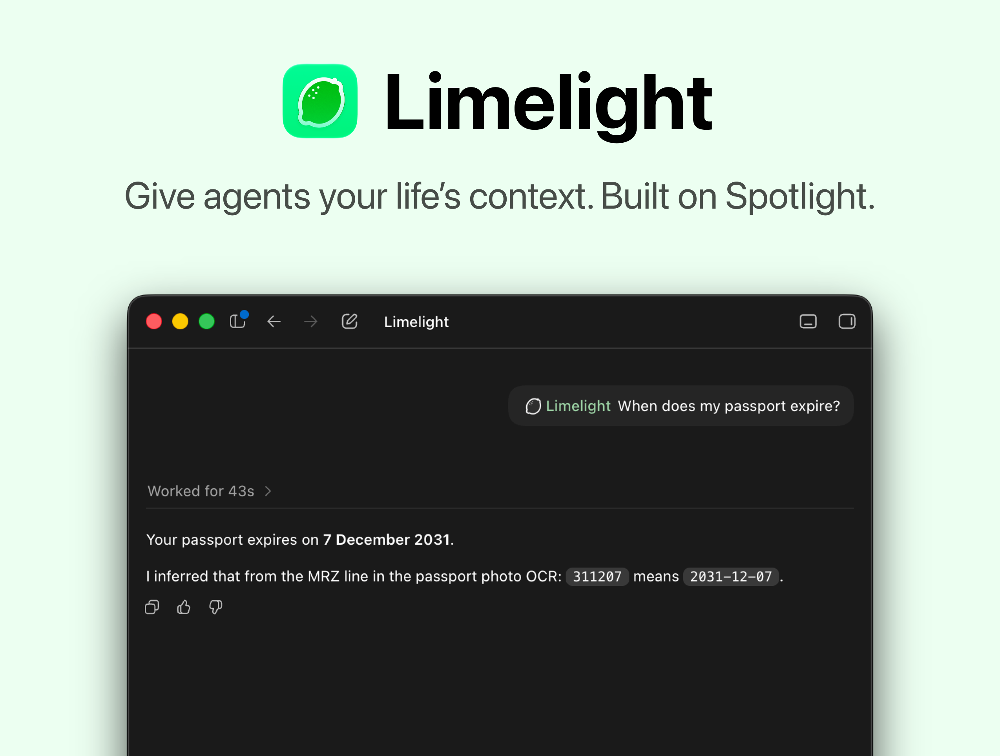

# Limelight

Limelight gives Codex and local agents a searchable window into your Mac's context: files, photos, mail, messages, notes, calendar, contacts, reminders, and Safari history.

It runs locally on your Mac and exposes a small loopback HTTP API so any agent or model can utilise it.



## Contents

- [Install](#install)
- [Use With Codex](#use-with-codex)
- [Use With Agents](#use-with-agents)
- [What It Can Search](#what-it-can-search)
- [Developer Quick Start](#developer-quick-start)
- [Documentation](#documentation)
- [Project Layout](#project-layout)

## Install

Download the latest pre-built `.dmg` from [GitHub Releases](https://github.com/b-nnett/limelight/releases), open it, and drag Limelight into your Applications folder.

After installing:

1. Launch Limelight.
2. Grant the macOS permissions it asks for.
3. Grant Full Disk Access to Limelight in System Settings for protected sources such as Mail, Messages, Notes, Safari, and some Calendar/Reminders stores.

Once running, Limelight listens on `127.0.0.1:8765` by default.

See [Installation](docs/INSTALLATION.md) for local development installs, signing, LaunchAgent setup, and auth.

## Use With Codex

Install the [Limelight Codex Plugin](https://github.com/b-nnett/limelight-codex-plugin#install) to use Limelight directly from Codex.

## Use With Agents

Agents can query Limelight through its local HTTP API. A basic search looks like this:

```sh
curl -s http://127.0.0.1:8765/v1/search \
  -H 'Content-Type: application/json' \
  -d '{"query":"passport","sources":["photos"],"types":["image"],"limit":5}'
```

For deeper integrations, see [API Reference](docs/API.md), the [Python client](docs/PYTHON_CLIENT.md), and the [TypeScript client](docs/TYPESCRIPT_CLIENT.md).

## What It Can Search

Limelight can search:

- files through native Spotlight metadata
- Photos library search/person indexes
- Contacts, Calendar, and Reminders through macOS frameworks and local fallbacks
- Notes, Mail, and Safari through local protected stores when Full Disk Access is granted

It does not persist a search cache and does not expose full document text by default. See [Providers](docs/PROVIDERS.md) for provider behavior, permissions, and caveats.

## Developer Quick Start

Requirements:

- macOS 14 or newer
- Swift 6 toolchain
- `jq` for probe scripts

Run the service directly:

```sh
swift run spotlight-index --host 127.0.0.1 --port 8765
```

Check that it is listening:

```sh
curl http://127.0.0.1:8765/health
```

Run tests:

```sh
swift test
```

See [Development](docs/DEVELOPMENT.md) for validation scripts, acceptance probes, and local app build instructions.

## Documentation

- [Installation](docs/INSTALLATION.md): DMG install, local app install, signing, LaunchAgent, and auth.
- [Providers](docs/PROVIDERS.md): searchable sources, permissions, readiness, and limitations.
- [API Reference](docs/API.md): endpoints, request examples, toolbox endpoints, and auth headers.
- [Development](docs/DEVELOPMENT.md): project setup, tests, validation scripts, and capability matrix generation.
- [Capability Matrix](docs/CAPABILITY_MATRIX.md): generated live provider capability table.
- [Python Client](docs/PYTHON_CLIENT.md): dependency-free Python client for the local HTTP API.
- [TypeScript Client](docs/TYPESCRIPT_CLIENT.md): typed `fetch` client for Node 18+ and browsers.

## Project Layout

```text
Sources/SpotlightIndexCore/   Core search providers, HTTP API, models, and permission helpers
Sources/spotlight-index/      CLI entry point and menu bar app shell
Tests/                        Swift tests for query building, normalization, providers, and integration behavior
scripts/                      Local install, signing, probes, and validation utilities
clients/python/               Small Python SDK for the local HTTP API
clients/typescript/           TypeScript SDK for Node 18+ and browsers
docs/                         Installation, API, provider, development, and capability docs
```
